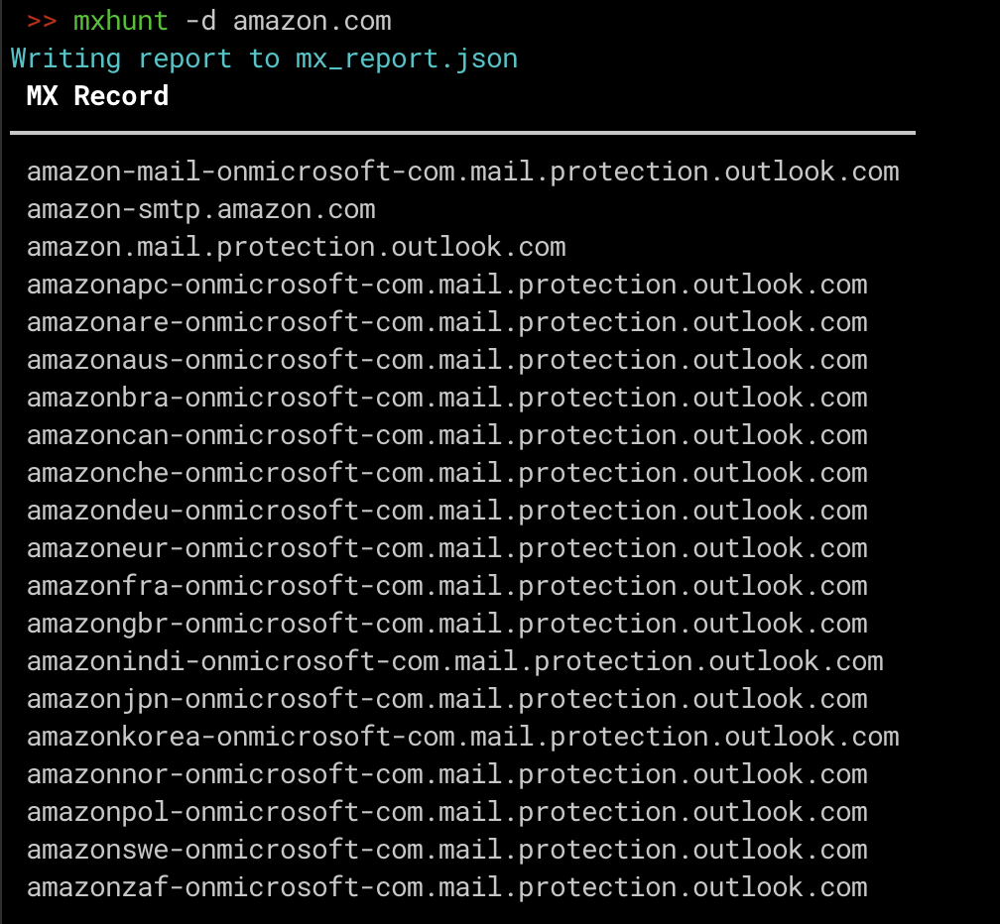

# MXHunt

## Description
MXHunt is a tool that helps you find mail exchanger records related to Microsoft tenant domains. It discovers Microsoft Office 365/Exchange Online domains through MSOL (Microsoft Online Services) autodiscovery and identifies their associated mail servers. This tool is particularly useful for penetration testers and bug hunters who want to enumerate mail infrastructure for reconnaissance purposes.

### Key Features
- **MSOL Domain Discovery**: Automatically discovers Microsoft tenant domains using Exchange autodiscovery
- **Microsoft Mail Server Detection**: Identifies and validates Microsoft mail protection servers (*.mail.protection.outlook.com)
- **Comprehensive MX Record Enumeration**: Finds both standard MX records and Microsoft-specific mail servers
- **Local DNS Validation**: Validates discovered mail servers using local DNS resolution (no rate limiting concerns)
- **Duplicate Removal**: Intelligent deduplication with case-insensitive comparison
- **Multiple Output Formats**: Supports both text and JSON output formats

## Installation
```bash
pipx install git+https://github.com/minniear/MXHunt.git
```

## Usage
```bash
usage: mxhunt [-h] [-r RATE] [-q] (-d DOMAIN | -f FILE) [-j JSON] [-o OUTPUT]

Hunt for mail servers using MSOL

options:
  -h, --help            show this help message and exit
  -r RATE, --rate RATE  Rate limit of concurrent connections (default: 10)
  -q, --quiet           Quiet mode, do not output mail servers to console

Input Options:
  -d DOMAIN, --domain DOMAIN
                        Domain to check
  -f FILE, --file FILE  A file with domains to check

Output Options:
  -j JSON, --json JSON  JSON report file base name (ex: mx_report)
  -o OUTPUT, --output OUTPUT
                        TXT output file base name (ex: mx_servers)
```

## Examples

### Single Domain Check
```bash
mxhunt -d contoso.com
```

### Multiple Domains from File
```bash
mxhunt -f domains.txt -o mail_servers -j detailed_report
```

### Quiet Mode with Output Files
```bash
mxhunt -f domains.txt -o mail_servers -j report -q
```

## Output

The tool provides multiple types of output:

1. **Console Display**: Clean table showing discovered MX records
2. **Text File**: Line-separated list of mail servers (with `-o` option)
3. **JSON Report**: Detailed report with domain relationships and priorities (with `-j` option)

### Sample Output
```
Found tenant domain: contoso.com
 MX Record                                   
━━━━━━━━━━━━━━━━━━━━━━━━━━━━━━━━━━━━━━━━━━━━━
contoso-com.mail.protection.outlook.com     
contoso.mail.protection.outlook.com         
mx1.contoso.com                             
mx2.contoso.com                             
```

## How It Works

1. **MSOL Discovery**: Queries Microsoft's autodiscovery service to find tenant domains
2. **MX Record Enumeration**: Retrieves standard MX records for discovered domains
3. **Microsoft Mail Server Detection**: Generates and validates potential Microsoft mail protection servers
4. **DNS Validation**: Uses local DNS resolution to verify server existence
5. **Deduplication**: Removes duplicates and normalizes casing
6. **Output Generation**: Produces clean, formatted results

## Example
